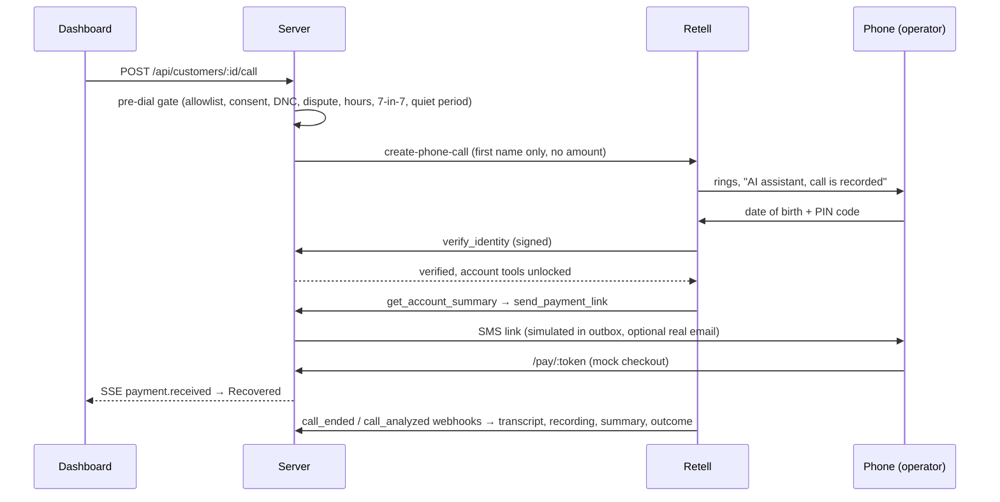

# Autopay Recovery Voice Agent

An outbound AI voice agent that phones customers whose autopay failed and gets the payment recovered. It verifies the caller, explains the failure in safe wording and resolves it with real backend actions: retry, secure payment link, promise-to-pay, payment plan, fee waiver, dispute, or do-not-call. A live dashboard shows each call as it happens.

Built on **Retell AI** (telephony, speech-to-text, LLM, text-to-speech) with a **TypeScript / Express / SQLite** backend and a **React** dashboard. All 10 customer records are fictional. **Every call goes to one phone number that the operator controls. The server will not dial any other number.**

> Demo video: _add link_ · Sample call transcripts: [`demo/calls/`](demo/calls)

## How a call works



## The 10 fictional accounts

| # | Customer | Failure | Path the demo exercises |
|---|---|---|---|
| 1 | Aarav Mehta | insufficient funds (since topped up) | `retry_payment` succeeds on the call |
| 2 | Priya Nair | expired card | update-method link → pays on phone |
| 3 | Rohan Gupta | insufficient funds until payday | promise-to-pay ≤ 14 days |
| 4 | Sneha Iyer | card reported lost | says only "issuer declined" + update link |
| 5 | Vikram Singh | UPI AutoPay mandate revoked | new-mandate link, churn check |
| 6 | Ananya Rao | NACH bank account closed | switch method, no retry |
| 7 | Karan Malhotra | says "already paid" | ledger match → collection paused, escalated |
| 8 | Meera Joshi | hardship (Hindi/Hinglish) | late-fee waiver + 3-part plan |
| 9 | Arjun Das | on do-not-call list | **dialer refuses before dialing** |
| 10 | Divya Kapoor | card limit reached | part-payment link + promise for the rest |

Each record has a DOB, a PIN code and a "play it like this" tip. The dashboard shows them so the person answering the phone can play the customer.

## Guardrails are enforced in code, not only in the prompt

| Rule | Where |
|---|---|
| Only numbers in `ALLOWED_DIAL_NUMBERS` can ever be dialed | `src/policy/dialPolicy.ts` |
| Pre-dial gate, in order:<br>- consent<br>- do-not-call<br>- open dispute<br>- nothing owed<br>- open promise-to-pay or agreed plan<br>- one live call at a time<br>- 08:00–19:00 customer local time, with room for a full 5-minute call<br>- at most 7 attempts in 7 days<br>- 7-day quiet period after a conversation | `src/policy/dialPolicy.ts` |
| Account tools return `NOT_VERIFIED` until DOB + PIN match; 2 misses lock the call | `src/retell/functions.ts` |
| The agent learns the amount only after verification (dial-time variables carry the first name only) | `src/calls/dialer.ts` |
| No card/OTP/PIN is ever collected by voice; payment goes through a secure link | prompt + `send_payment_link` |
| Lost/stolen card shown to the customer as a generic issuer decline | `src/policy/offers.ts` |
| Offer limits: promise-to-pay ≤ 14 days, plans of 2–3 parts, part-payment ≥ ₹500 or 20%, fee waiver only on a first failure, at most 2 retries | `src/policy/offers.ts` |
| Voicemail gives company + callback number only (no amount, no reason) | `src/agent/agentConfig.ts` |
| Every Retell request is HMAC-verified against the raw body. The signed tool name must match the URL | `src/retell/verify.ts`, `src/app.ts` |
| Webhooks are idempotent per `(event, call_id)`; the receipt and writes share one transaction | `src/retell/webhooks.ts` |
| The tunnel only reaches the public listener (`/retell`, `/pay`, `/health`). The dashboard API listens on 127.0.0.1 only | `src/app.ts`, `src/server.ts` |
| Tool calls and call creation are never auto-retried, so nothing is applied or dialed twice | `src/agent/agentConfig.ts`, `src/retell/client.ts` |

The calling window is the stricter of the RBI recovery-call rule (08:00–19:00) and FDCPA/Reg F (08:00–21:00). Frequency limits follow Reg F's 7-in-7 presumption. Recording and AI disclosure come first in every call, following the FCC's 2024 ruling on AI voices. This is a demo, not legal advice.

## Run it

Prerequisites:
- Node 22 (`nvm use`)
- `brew install cloudflared`
- A [Retell](https://www.retellai.com) account with a card on file. Use the API key that has the webhook badge. The $10 free credit covers about 40 minutes of calls to India.

```bash
npm install
cp env.example .env          # set RETELL_API_KEY, DEMO_PHONE_NUMBER and ALLOWED_DIAL_NUMBERS (your own phone, E.164)
npm run smoke:call           # buys a US number (~$2/mo) and rings your phone with a 10-second test
npm run live                 # builds the UI, starts both listeners + a cloudflared tunnel, provisions the agent
open http://localhost:3000
```

**`smoke:call` decides whether the phone demo will work. Run it before anything else.**
- Retell's SDK docs say purchased numbers dial US numbers only, but its international-calling page lists India at $0.15/min.
- If the test call doesn't ring, import a Twilio US number into Retell (Twilio needs Voice Geo Permissions for India). No code changes are needed.
- Or use the **Browser** button instead.

| Port | Listener | Reachable from |
|---|---|---|
| 3000 | dashboard + API | localhost only |
| 3001 | `/retell/*`, `/pay/*`, `/health` | the tunnel |

`npm run live` re-provisions on every start, because a quick tunnel's URL changes each run. It updates the Retell LLM (prompt + 13 tools pointing at the tunnel), the agent (voice, languages, webhooks, voicemail, post-call analysis) and the number binding. The provisioned IDs are saved in the gitignored `.retell.json`.

No phone? Every row has a **Browser** button. It runs the same agent, tools and webhooks over WebRTC.

### Demo script (about 6 minutes)
1. **Priya (#2):** Call → answer → give her DOB and PIN → ask for the link → open it from the Outbox on your phone → pay with `4242 4242 4242 4242`. The row turns **recovered** and the KPI moves.
2. **Rohan (#3):** promise to pay in 6 days. Try 20 days first; the agent is told the policy limit.
3. **Meera (#8), in Hindi:** hardship → fee waived → 3-part plan.
4. **Vikram (#5):** say "stop calling me" → opted out. Press Call again; the compliance log shows the block.
5. **Arjun (#9):** Call is disabled: on the do-not-call list.
6. Decline a call to see the voicemail / no-answer disposition. Click any call for the transcript, recording, tool calls and Retell's post-call analysis.

**Reset demo** restores all 10 failed autopays.

## Tests

```bash
npm test          # 60 tests: policy gates, time math, offer limits, signed tool calls, end-to-end flows, campaign
npm run typecheck
```

`test/app.test.ts` signs real Retell-shaped payloads with `Retell.sign`. It drives full conversations through the HTTP endpoints:
- verify → summary → link → checkout → recovered
- retry
- promise-to-pay
- hardship plan
- part-payment
- already paid
- do-not-call

It also checks that:
- unsigned or tampered requests get a 401
- the public listener exposes nothing from the dashboard
- concurrent dials ring the phone only once
- a stopped campaign stops promptly

Before release, the whole stack was also run as a real server:
- every API route was driven over HTTP on both listeners, including real Retell SDK error paths: 67/67 checks pass
- the dashboard, call drawer and all 7 checkout states were audited at 9 widths (320–1920px) in light and dark mode, for horizontal overflow, WCAG AA contrast and 32px touch targets

## Layout

```
src/agent/      prompt.md, tool specs (zod → JSON Schema), Retell provisioning
src/retell/     signed tool endpoint handlers, webhooks, SDK wrapper
src/policy/     dial gate, offer rules, timezone math
src/payments/   retry simulator, payment links, ledger
src/calls/      dialer + sequential campaign, dispositions
src/api/        dashboard state + KPIs
src/pay/        mock checkout page
web/            React dashboard (SSE live updates, Retell web-call fallback)
scripts/        tunnel + auto-provision, PSTN smoke test, call export
```

## What is simulated
- **Payments:** the mock checkout only accepts `4242 4242 4242 4242`, and nothing typed there is stored. Retry outcomes come from each record's `retry_outcome`.
- **SMS:** goes to the dashboard Outbox. Set `RESEND_API_KEY` + `DEMO_EMAIL` to also get the link by email.
- **Escalations:** they become tickets in the dashboard; nothing transfers the call to a live person.
